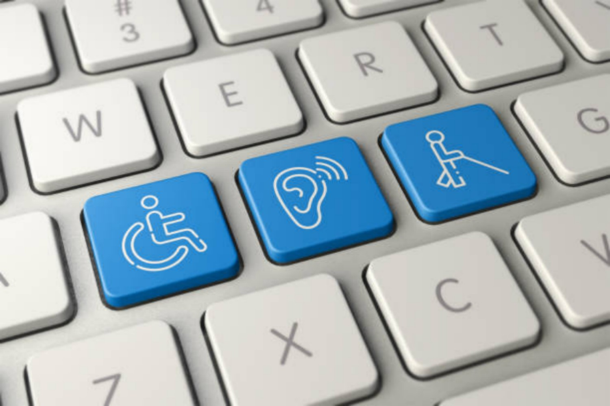
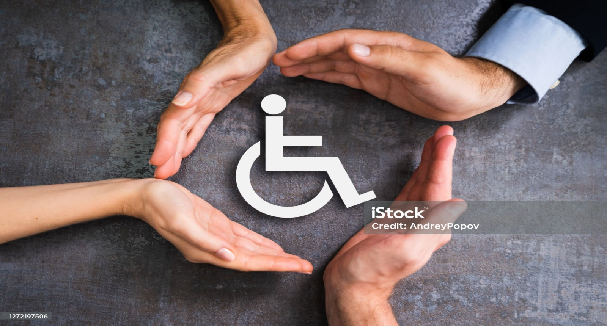
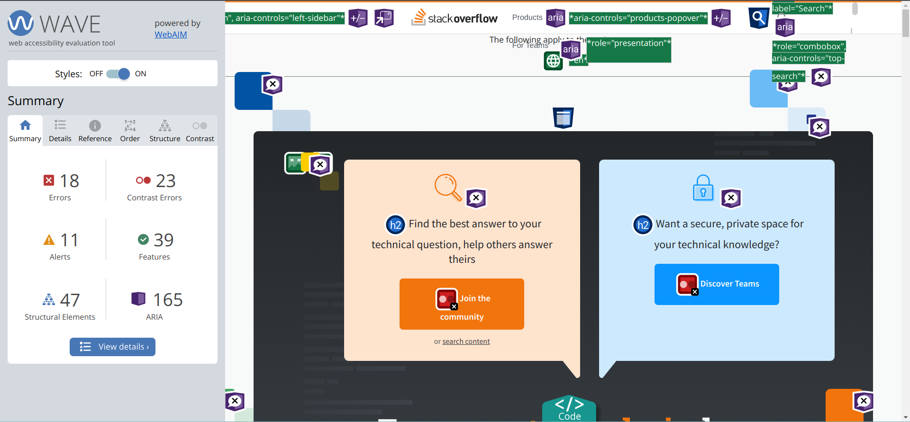
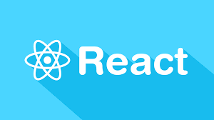
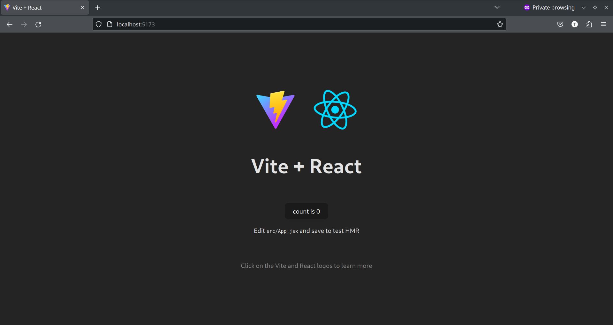

# Introduction

Hello everyone, My name is Terkuma, pronounced 'Taykuma'. I am from Nigeria and I am a web developer, front end to be specific. I usually work with HTML, CSS,Tailwind and ReactJS. My adventure doesn't stop there, I am currently learning python programming language.

In my personal time, I prefer to listen to podcasts, some of my favorites are [Science Vs](https://open.spotify.com/show/5lY4b5PGOvMuOYOjOVEcb9?si=1f69031662694af2), [Hidden Brain](https://open.spotify.com/show/20Gf4IAauFrfj7RBkjcWxh?si=4de1667450404c77), [TechLinked](https://open.spotify.com/show/1cBhYjm2fildfRsNDEYLcm?si=e6394557c24242fc) and [Easy German](https://open.spotify.com/show/2rnCPyV8A9J80QtmGj2pAx?si=3da7e20bfd4d4b72) Podcast. Listening to music is another activity I really love to do. I listen to a lot of pop these days and some of my favorites in the genre are Post Malone, TheWeeknd and Halsey. [Austin](https://open.spotify.com/album/6r1lh7fHMB499vGKtIyJLy?si=sg7qFdOPRzadXPMxPm3R1Q), by Post Malone, is an album that has been on my radar for a while now. Occasionally, I get involved in physical activities like running or playing badminton.


As a newcomer to the Outreachy program, I'm brimming with excitement and curiosity. For me, it's more than just an opportunity; it's a gateway to acquiring new skills, forging connections with fellow contributors and mentors, and contributing meaningfully to the open source community. I can't wait to get to know you all better. :)

### Links to Relevant Platforms
|Platform |Link |
|---------| :--:|
| GitHub  | <https://github.com/FanyamTerkuma>    |
| Blog    |  <https://terkumafanyam.hashnode.dev/>   |
| X(Twitter) |   <https://twitter.com/OutisTF>  |


## Tasks

#### Checklist: Getting started with Outreachy

This is the first checklist for candidates to go through.

- [x] Read the official [Outreachy Applicant Guide](https://www.outreachy.org/docs/applicant/). All of it.
- [x] Read the official [Outreachy Internship Guide](https://www.outreachy.org/docs/internship/).
- [x] If you haven’t already, create a GitHub account.
- [x] Introduce yourself on our [Welcome to Wagtail! Introductions](https://github.com/wagtail/outreachy/discussions/1) discussion thread.
- [x] And-or introduce yourself [on the Wagtail Slack](https://github.com/wagtail/wagtail/wiki/Slack) in [#new-contributors](https://github.com/wagtail/wagtail/wiki/Slack#new-contributors).
- [x] Set up your own personal blog. Blogging is a fundamental part of Outreachy, and generally a good way to solidify learnings. You can use a personal website if you want to, or keep it simple and use a platform like Dev.to, Hashnode, or Medium.

### Checklist: open source contributions

> For participants already experienced with GitHub and Markdown, feel free to go through all the suggested tasks in a single pull request.

This checklist helps you demonstrate your understanding of how people use GitHub to collaborate.

- [x] Read through [How to contribute to open source](https://opensource.guide/how-to-contribute/)
- [x] Read [Open source etiquette](https://developer.mozilla.org/en-US/docs/MDN/Community/Open_source_etiquette)
- [x] Make your first [pull request](https://docs.github.com/en/pull-requests/collaborating-with-pull-requests/proposing-changes-to-your-work-with-pull-requests/creating-a-pull-request) with us! Add your name to the list of participants in [2023/README.md](2023/README.md).

### Checklist: your contribution period with Wagtail

And now, we will want you to start using GitHub so we can review your progress over time, your research ahead of the application, and provide feedback.

- [x] Make a fork this repository, then add a new folder inside `2023/` with your name as the folder name. Inside that folder, add a `README.md` file, and copy-paste the introduction you posted earlier. Submit this to our project as a pull request.
- [x] Read through GitHub’s [Markdown formatting documentation](https://docs.github.com/en/get-started/writing-on-github/getting-started-with-writing-and-formatting-on-github/basic-writing-and-formatting-syntax)
- [x] Now make another pull request to your own README file, adding a Markdown table with links to:
  - [x] Your GitHub profile
  - [x] Your personal website / blog
  - [x] Your preferred social profiles if any
- [x] Update your pull request to add a new `## Tasks` section to your README file, and copy-paste our contributor guide’s checklists into it, marking each item as completed or not according to your progress.

To stand out as an applicant,

- [x] Help others with their pull requests – spotting steps they might have missed, or suggesting improvements to their pull requests.
- [x] Demonstrate good awareness of open source etiquette when creating your pull requests (for example, adding an appropriate title and description, even if very concise).

### Checklist: interest in learning

With this checklist, we expect you to demonstrate an ability to do research and learn new things. All tasks here will require updating your participant file within your fork of the `outreachy` repository in the `2023/` folder, and making pull requests.

- [x] Create a new `## Research` section in your personal file, with a list of links to the resources you’ve found most useful so far in trying to understand Wagtail as a project and the specific project idea(s) you’re interested in. Make sure to use full Markdown link syntax (`[link text](link url)`), so we can understand your choice of resources.
- [x] Write a short blog post describing things you’ve learned recently, and share it with us. The post must be in English, include at least one image, be less than 500 words, and score a Grade 7 or better on <https://hemingwayapp.com/>. You can describe any recent learnings – share a list of the last few articles you read and liked, or focus on one specific thing you’ve been learning. It can be a broad area or a very narrow subject. It doesn’t have to be about tech. The post has to be posted on a publicly-available platform (Dev.to, Hashnode, Medium, your own website), and you must also add it as a new section in your personal file in this repository (so we can provide feedback on the contents).

### Checklist: Accessibility features documentation

🚧 This checklist is for candidates interested in working on the [Accessibility features documentation](https://github.com/wagtail/outreachy/blob/main/project-ideas.md#accessibility-features-documentation) project.

- [x] Write a short blog post which demonstrates your understanding of **accessibility**. In English, with at least one image, less than 500 words. Demonstrate your understanding _based on past experiences_. For example, any specific accessibility improvements you’ve done in the past, or specific issues you identified. The more specific the better. The post has to be posted on a publicly-available platform (Dev.to, Hashnode, Medium, your own website), and you must also add it as a new section in your personal file in this repository (so we can provide feedback on the contents).
- [x] Write a short blog post which demonstrates your expertise in **technical writing**. In English, with at least one image, less than 500 words. Demonstrate your expertise _based on past experiences_. For example, any specific documentation writing you’ve done in the past, or other technical writing you’ve made. The more specific the better. The post has to be posted on a publicly-available platform (Dev.to, Hashnode, Medium, your own website), and you must also add it as a new section in your personal file in this repository (so we can provide feedback on the contents).
- [ ] Ask [@thibaudcolas](https://github.com/thibaudcolas) via email or on Slack to give you editor access to a Wagtail website. Once you’ve received access, we ask you to create a new page demonstrating some of Wagtail’s accessibility features.
- [ ] With your access to the demo site and by reviewing our [user guide](https://guide.wagtail.org/), identify a feature of Wagtail which isn’t documented, and report it back on the [guide project issue tracker](https://github.com/wagtail/guide/issues). Make sure to explain what the feature is, why and how you think it should be documented.
- [ ] Draft the new content to document the feature of Wagtail which you’ve reported isn’t documented. Add it to the issue you created as a new comment, so we can provide feedback.
- [ ] Ask [@thibaudcolas](https://github.com/thibaudcolas) via email or on Slack to give you editor access to [guide.wagtail.org](https://guide.wagtail.org/). Once you’ve received access, we ask you to make the necessary changes in the CMS to add the feature documentation.
- [ ] TBC – Additional tasks specific to the Outreachy application process.

## Research

I found some of these resources valuable in my effort to understand  Wagtail as a project and Web accessibility. I am interested in contributing to the Wagtail's web accessibility feature documentation:

- [About Wagtail]( https://wagtail.org/about-wagtail/): I used this to get the general idea of Wagtail.
- [web.dev](https://web.dev/accessibility/): This helped me to get familiar with accessibility.
- [WebAIM](https://webaim.org/standards/wcag/checklist): Provided summaries of the [WCAG](https://www.w3.org/TR/WCAG22/) standards
- [Silktide](https://www.youtube.com/playlist?list=PLWSYD-KxdDxsgf16rlLlotPHo2LLo0EGr): This playlist was immensely helpful. It has short and concise videos.


## Recent Learnings (Blog post)

### [Accessibility and Inclusivity in Web Development](https://terkumafanyam.hashnode.dev/accessibility-and-inclusivity-in-web-development)



Accessibility, inclusivity and web development, Hmm, how did these words get mixed? I asked myself. Whenever I visit a website, the first thing that catches my attention is the user interface. Is it a site I would like to visit again or not? I used to think that websites were more about having a nice or fancy User Interface (UI). So what is web accessibility, what does web inclusivity mean?

Web Accessibility is the practice of designing websites and technologies for everyone. It is an inclusive practice, which means people with disabilities can use them. Now that we know what accessibility means, I would like to share an experience.

My experience is with a senior developer that I worked with. During a code review, he told me that I used too many div elements in my reactJS code and that my alt texts were vague. Who is going to need the image descriptions anyway? what I thought to myself for quite a while but I was dead wrong. I have gotten a proper insight after learning about accessibility. As a front-end developer, once my web pages looked good and worked as expected, I felt good. I didn't take care, I could make a div to function like a button and images on my site did not have descriptive alt texts.

Now, let's explore why accessibility is important. Let's look at a typical tool we use often, PDF readers. These are apps we use to read electronic documents. PDF readers like Foxit Reader have a feature called "read aloud". This feature reads out the content of your document when activated. People with visual disabilities rely on assistive features like this. Let's do a quick exercise to show how this particular 'read aloud' feature aids this category of people.

The first step is to open any document on your device (PC or mobile) using a PDF reader. Try reading it with your eyes shut. It was impossible, right? Now, open your eyes and find the 'read aloud' button and click it. Now close your eyes again. what is different this time? yes, that's correct. you can hear what is in the document. For a moment we couldn't use our eyes but we were able to get the information we needed from our document. yay! Some people can not see, they have to rely on assistive technologies like screen readers to read.

Screen readers navigate websites as well. Non-accessible websites make it almost impossible to help disabled people. A screen reader can not know when a website uses a div instead of a button. The screen reader would miss it so would the user.

So far I have only talked about visual impairments but there are other forms of impairments. They can be physical, speech, cognitive, auditory or neurological impairments. As developers, we should aim to build websites or technologies that are accessible.

Thanks for reading to the end. I hope you enjoyed your journey with me. :) <https://terkumafanyam.hashnode.dev/accessibility-and-inclusivity-in-web-development>


### Checklist: Accessibility features documentation

### Blog post on my knowledge of accessibility

### [A Gentle Guide to Accessibility](https://terkumafanyam.hashnode.dev/a-gentle-introduction-to-accessibility)



Accessibility, what does this even mean, anyway? Is it important? Do I have to bother myself with it? if this is you, I have great news for you. You are not alone. Allow me to guide you through the world of web accessibility.

The scope of Accessibility is broad. In this post, our focus is on Web accessibility.

#### What is Web Accessibility?

Web Accessibility is the practice of designing websites that everyone can use. This is regardless of their abilities or disabilities.

#### Why does Web Accessibility Matter?

Have you ever wondered how or if people with disabilities interact with websites? Well, with the aid of assistive technologies, they can interact with the web. But this depends on how accessible the websites are. Web accessibility makes it easier for these technologies to help the impaired.

Let's look at an accessibility issue that is peculiar to my case. I have a visual condition, dry eyes syndrome, to be exact. Certain color contrasts don't work for me, they cause my eyes to hurt after a short while. Darker themes are much more accommodating for my eyes. Due to my eye condition, using sites that do not provide a theme customization option is not ideal for me. It will be a nightmare if my workflow depends on such sites.

#### How can I tell if a Website is Accessible or Not?

A website is accessible if it meets the standards of WCAG or ATAG (for the producers of the web content). Does this mean I have to refer to these guidelines every time I make use of a website? No, is the short answer. Accessibility Checkers help us to check the accessibility of websites. These tools check if websites follow the WCAG or ATAG. After the check, a generated report records all the accessibility issues found. Some authoring tools like the Wagtail CMS include in-built accessibility checkers.



The image above is an example of what an accessibility report looks like. WAVE is what I used to check the accessibility of Stackoverflow's home page here.

#### Conclusion

So far, we've looked at what web accessibility is and why it is important. We also looked at how we can test for web accessibility. Feel free to explore further on web accessibility. You can also look into other aspects of accessibility.

Cheers for making it to the end of our journey. :)


## Blog post on Technical writing

## [A Beginner's Guide to React: Understanding its Power and Setting Up Your First App](https://terkumafanyam.hashnode.dev/a-beginners-guide-to-react-understanding-its-power-and-setting-up-your-first-app)



React is an efficient and versatile web development tool. But what is special about React? If you are new to React, this guide will help you understand what sets it apart.

### What is React?

To appreciate React, we need to know what it is. This begs the question, what is React? React is an open-source JavaScript library for creating User Interfaces (UIs). It is component-based, which means breaking the UIs into smaller reusable building blocks.

### Why React?

React is very popular among developers, but why? What makes it so powerful and special? let's take a look at some of the reasons.

React enables code reusability by breaking the UI into smaller, reusable blocks. For instance, you can create and reuse a button across your website. This eliminates the need to recreate it every time.

There is a large community of developers and companies maintaining React.

React is unidirectional. It only supports the flow of data from parent to child components. That is, a child component can not send data back to the parent. This makes it easier to track how data changes affect your app and debug.

React makes use of Virtual DOM. This enhances its performance by updating parts of the website only if they have changed.

### Getting Started with React

Now that we know what React is. Let's see how we can set up a React app.

To set up our React development environment, we'll be using Node.js. It's a JavaScript runtime environment. If you haven't installed Node.js already, you can follow the steps on the official Node.js website.

### Setting up React with Vite

We'll be creating our React app with Vite. To begin, you need to create a new directory and navigate into it.


```
mkdir name_of_our_project
cd name_of_our_project
```


Now that you are in your directory, you can run the following command to initialize the setup.


```
npm create vite@latest
```

Follow the prompts to complete the project setup. Once completed, a new folder should be in your current directory. Navigate into it and run the following commands.


```
npm install
npm run dev
```

The first command will install all the dependencies required for your app to run. The second command starts your dev server. this allows you to preview changes you make to your app.

The output of your terminal at this point should look like this. This is a confirmation that your app is running.

```
  VITE v4.4.11  ready in 4680 ms

  ➜  Local:   <http://localhost:5173/>
  ➜  Network: use --host to expose
  ➜  press h to show help
  ```

Hold down `ctrl + click` on the localhost URL to view your app in the browser. Your output should look as shown below.



Congratulations if you have made it to this point. We were able to explore React and set up our first React app. Cheers :)
